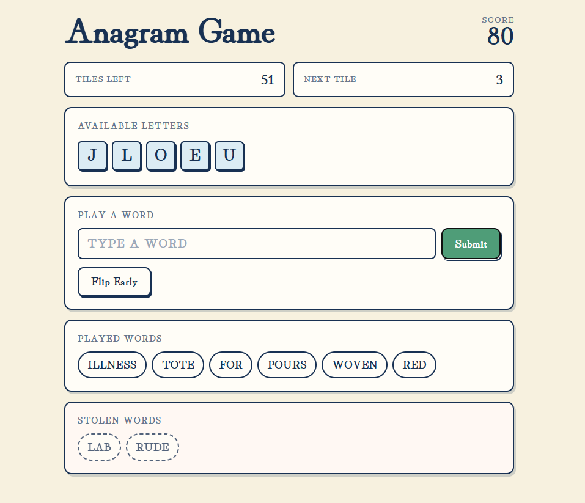

# Anagram Game

A timed browser word game built with React and TypeScript. Obtain the highest score by building and transforming words from a finite seeded pool of letter tiles before they expire.

**[Play Anagram Game](https://charlieomiller.github.io/anagram-game/)**



## About

The game is heavily inspired by the tile based board game _One-Up!_, one of my favorite board games. My main motivation for developing this anagram game was that my family and friends are tired of getting whooped by me in _One-Up!_.

The game's core ruleset is similar, but modified for a better single-player experience.

- Words must be at least 3 letters long
- Tiles expire after the max capacity of 8 is reached
- Select an existing word to reuse its letters in a larger word
- Each new word must use at least one letter from the tile pool
- Multiple words can be selected and combined when making a larger word
- Your rightmost word will be stolen periodically
- Stolen words can be used to make new words, returning the lost points to you
- Stolen words expire after the max capacity of 2 is reached
- Longer words are worth more points. Each additional letter adds one more point than the previous one. EX: "car" = 1 + 2 + 3 = 6, "race" = 1 + 2 + 3 + 4 = 10

## Features

- Seeded, deterministic letter generation
- Timed letter drawing and expiration
- Word transformation / combination mechanics
- Dictionary validation
- Scoring based on word length
- Reproducible game seeds

## Tech Stack

- React
- TypeScript
- Vite
- Vitest
- GitHub Actions
- GitHub Pages

## Testing and Reliability

- Game logic is separated from React UI to keep core behavior isolated and testable
- Deterministic seeds make letter sequences reproducible for testing and debugging
- Vitest covers core engine behavior and game-state transitions
- GitHub Actions runs tests, linting, and production builds before deployment, preventing failed builds from being published.

## Running Locally

```bash
npm install
npm run dev
```

## Testing

```bash
npm test
```

## Build

```bash
npm run build
```

## Takeaways/What Could Be Done Better

- Full deterministic replay: The game currently uses deterministic seeds and tracks score history, but fully recording player actions as well would mean the entire game would be reproducible for debugging. This would also allow for undoing/redoing to be easily implemented.
- Broader regression tests: Current tests focus on core engine mechanics. Additional tests covering edge cases, state invariants, and replay consistency would be more robust.
- Integrated tutorial: Less focused on the technical side, a tutorial that was integrated into the first play session of the game would greatly benefit the experience of new players. Additional visual feedback on changing score, expiring tiles, and impressive combinations would also improve the overall game feel.
